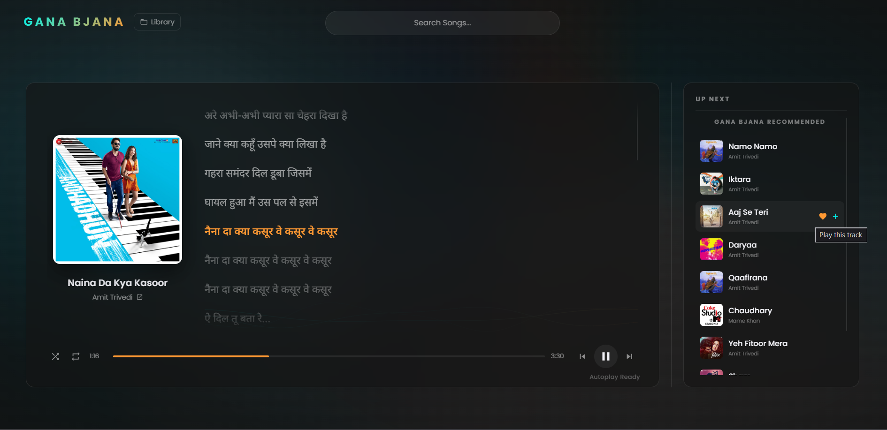

# Spotify Premium Landscape Player

A beautiful, glassmorphic web-based music player designed for landscape orientation, built with HTML, CSS, and JavaScript. 


## Features

* **Spotify Premium Integration:** Connects directly to your Spotify Premium account using the official Web Playback SDK.
* **Glassmorphism Design:** A stunning, modern interface with a frosted glass panel, deep shadows, and an ultra-blurred background layer that dynamically matches the album art of the currently playing song.
* **Synchronized Lyrics:** Fetches and displays time-synced lyrics from LRCLIB. The lyrics scroll automatically to keep the active line centered, with a sleek fade and highlight effect.
* **Full Playback Controls:** Play, pause, skip, go back, and an interactive hover-to-scrub progress bar.
* **Smart Autoplay (Gana Bjana):** Never stop the music! When your queue ends, the player automatically finds and plays recommended tracks based on what you were just listening to.
* **Search Integration:** Instantly search for any song on Spotify and play it with a single click.

## Prerequisites

1.  **A Spotify Premium Account.** The Spotify Web Playback SDK *requires* an active Premium subscription to stream audio.
2.  **Spotify App Credentials:**
    *   You need a `CLIENT_ID` from the [Spotify Developer Dashboard](https://developer.spotify.com/dashboard/).
    *   Set the Redirect URI in your Spotify app settings to match where you are hosting this file (e.g., `http://127.0.0.1:8000/index.html` or `http://localhost:8000/index.html`).

## Setup and Usage

1.  **Clone or Download:** Get the `index.html` file on your machine.
2.  **Configure Client ID:** Open `index.html` in a text editor and replace the `CLIENT_ID` constant (around line 316) with your own Spotify Client ID.
    ```javascript
    const CLIENT_ID = "YOUR_CLIENT_ID_HERE";
    ```
3.  **Run a Local Server:** Because the Spotify SDK and OAuth flow require a secure context or localhost, you must run this file through a local web server, not by double-clicking the file.
    *   Using Python: `python -m http.server 8000`
    *   Using Node.js: `npx serve` or Live Server in VS Code.
4.  **Connect:** Open `http://localhost:8000` (or your chosen port) in your browser.
5.  **Authenticate:** Click the "Connect Spotify" button. You will be redirected to log in and authorize the app.
6.  **Play:** Once authenticated, search for a song or start playing music on your phone/desktop app and select "Landscape Player" from the devices menu!

## Technologies Used

*   Vanilla HTML5, CSS3, JavaScript
*   [Spotify Web Playback SDK](https://developer.spotify.com/documentation/web-playback-sdk/)
*   [Spotify Web API](https://developer.spotify.com/documentation/web-api/)
*   [LRCLIB API](https://lrclib.net/) for synced lyrics

## Publishing to GitHub Pages

If you want to host this player online for free using [GitHub Pages](https://pages.github.com/):

1. **Push your code to GitHub:** Create a new repository and push this `index.html` file to it.
2. **Enable GitHub Pages:** Go to your repository settings on GitHub, navigate to "Pages", and enable it from the `main` branch.
3. **Update Spotify Dashboard:** Your live player will now have a new URL (e.g., `https://yourusername.github.io/your-repo-name/`). You **MUST** go back to the [Spotify Developer Dashboard](https://developer.spotify.com/dashboard/) and add this new URL to your app's **Redirect URIs** list.
   * If you don't do this, the "Connect Spotify" button on your live site will throw an `INVALID_CLIENT` or `Redirect URI mismatch` error.
4. **Play!** Visit your new GitHub Pages link, log in, and enjoy your music anywhere.
